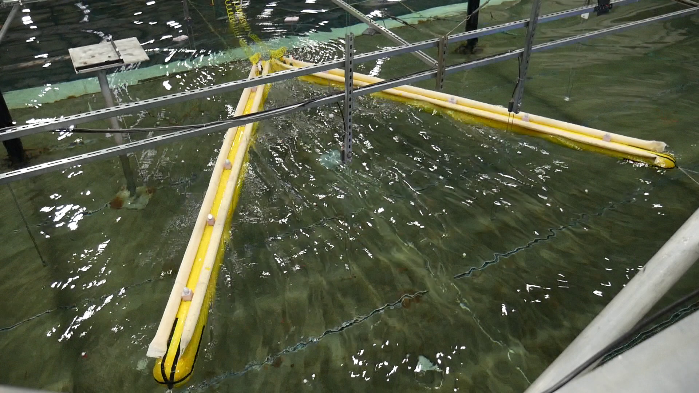
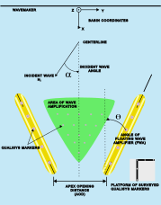
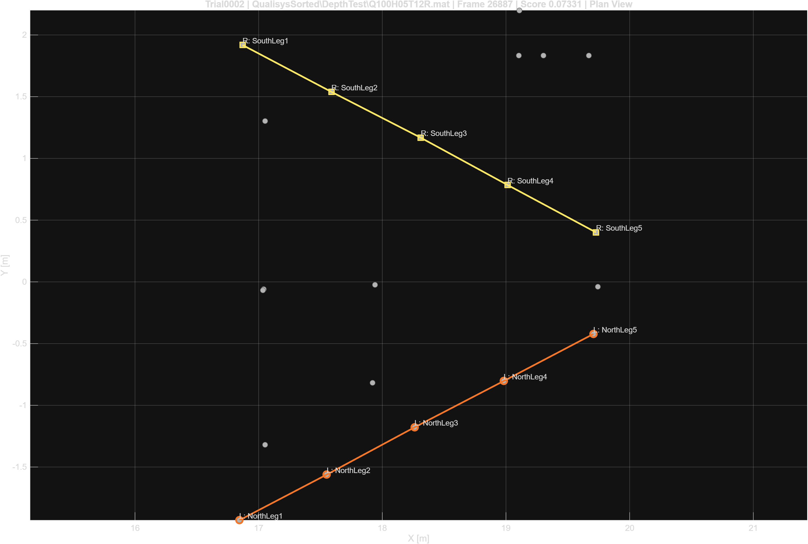
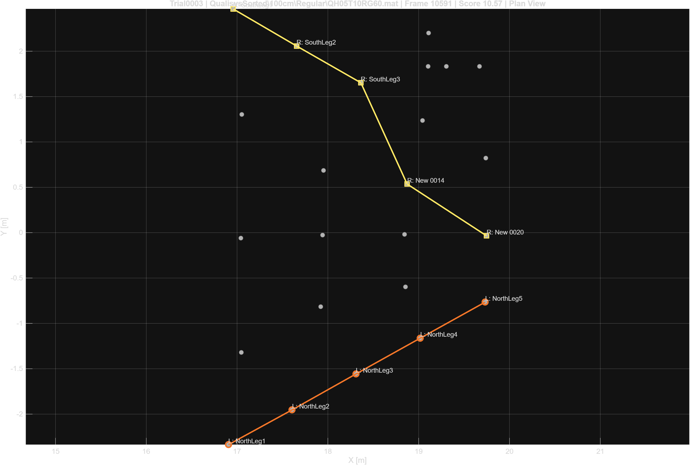
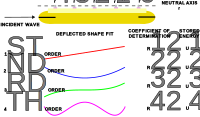

::: {.project-page}

# 2.1 Automating Beam-Point Identification in Floating Wave Amplifier Experiments

## A geometric classification workflow for experimental data analysis

## Overview

This project addressed a practical but critical data-analysis bottleneck in a broader floating wave amplifier research program: how to convert a large, inconsistent motion-capture archive into a usable dataset for structural and hydrodynamic analysis.

The experiments were conducted in the O.H. Hinsdale Large Wave Basin using two floating beams arranged in a V-shaped configuration. Across the campaign, multiple water depths, wave conditions, and beam-gap configurations were tested. In parallel, a WAMIT-based hydrodynamic workflow was developed to study amplification and shielding in an idealized two-beam system. The experimental archive provided the structural-response and validation data needed to connect those simulations back to the physical system.

The challenge addressed here was not the hydrodynamic simulation itself, but the automation of beam-point identification in the experimental archive.

## Why this problem was difficult

In principle, the motion-capture system tracked reflective markers attached to the beams and to rods in the surrounding water. Those measurements could be used to reconstruct beam motion, beam deformation, and nearby field response.

In practice, the archive presented several difficulties:

- beam markers did not remain static across the testing campaign
- labels were not fully consistent across runs
- beam geometry changed between configuration families
- the point cloud included both beam markers and fixed calibration points
- manual identification would have been repetitive, time-consuming, and difficult to reproduce consistently

A purely label-based approach was therefore not sufficient. The final workflow used a geometry-based classification strategy in a single representative frame, followed by extraction of the full time histories of the identified points.

## Experimental context

The device consisted of two floating beams arranged in a wedge-like V geometry. The broader project objective was to determine whether this arrangement could amplify the local wave field in a way that might benefit nearby wave energy systems.

On the simulation side, the hydrodynamic model used a frequency-domain reconstruction of the total wave field,

$$
\Phi_{\text{total}} = \Phi_I + \Phi_D + \sum_j \zeta_j \Phi_{R,j},
$$

where incident, diffracted, and radiated contributions were superposed after solving for the body motions.

The experimental archive was organized around two primary data sources:

1. Qualisys motion-capture data
2. Wave-gauge data

The main information needed for structural analysis came from the Qualisys archive.

## Representative-frame reduction

Let the Qualisys trajectory array be

$$
X \in \mathbb{R}^{N_m \times 4 \times N_t},
$$

where $N_m$ is the number of labeled markers and $N_t$ is the number of frames.

Rather than classifying beam markers over the full time history, the workflow first reduced the problem to a single representative frame. A window centered on the midpoint of the trial was searched, and the frame with the largest number of valid labeled markers was selected. If multiple frames tied, the frame closest to the midpoint was used.

This step converted a time-dependent classification problem into a static geometric one. Once the beam points were identified in that frame, their full trajectories could be extracted directly from the archive.

## Template families

A single global beam template was tested early and found to be insufficient. The beam geometry changed across configuration families, especially for cases with modified beam gap. The final method therefore used three template families:

- Standard
- Beam Apex Gap of 60 cm
- Beam Apex Gap of 120 cm

For each family, a small manually labeled training set was used to compute mean point locations, mean segment lengths, mean segment directions, and mean beam separations.

For beam $b \in \{L,R\}$ and ordered point $j=1,\dots,5$, the template mean point was defined by

$$
\bar{r}_{b,j}
=
\frac{1}{N_{\text{train}}}
\sum_{k=1}^{N_{\text{train}}}
r^{(k)}_{b,j}.
$$

Mean segment lengths were computed as

$$
\bar{\ell}_{b,j}
=
\frac{1}{N_{\text{train}}}
\sum_{k=1}^{N_{\text{train}}}
\lVert
r^{(k)}_{b,j+1} - r^{(k)}_{b,j}
\rVert,
\qquad j=1,\dots,4.
$$

## Point-specific gating

Selection was performed primarily in plan view. Let the observed marker positions in the representative frame be

$$
p_i \in \mathbb{R}^2,
\qquad i = 1,\dots,N_v.
$$

For each ordered beam point, a local candidate neighborhood was formed around the template point. Each point used either:

- a radius threshold in the $(x,y)$ plane, or
- if needed, the nearest $K_j$ points

This produced five point-specific candidate sets for the left beam and five for the right beam. A beam candidate was then formed by selecting one unique point from each candidate set.

This local gating strategy kept the search computationally cheap while still allowing flexibility across changing beam geometries.

## Beam scoring

For a candidate ordered beam chain

$$
q_{b,1}, \dots, q_{b,5} \in \mathbb{R}^2,
$$

the beam score was defined as

$$
J_b
=
w_p J_{\text{pos}}
+
w_s J_{\text{space}}
+
w_d J_{\text{dir}}
+
w_t J_{\text{turn}}
+
w_\ell J_{\text{line}}.
$$

The score combined:

- position mismatch
- segment-length mismatch
- segment-direction mismatch
- turning-angle smoothness
- a weak linearity penalty

For example, the position mismatch term was

$$
J_{\text{pos}}
=
\sum_{j=1}^{5}
\lVert
q_{b,j} - \bar{r}_{b,j}
\rVert^2.
$$

The segment-length mismatch term was

$$
J_{\text{space}}
=
\sum_{j=1}^{4}
\left(
\lVert
q_{b,j+1} - q_{b,j}
\rVert
-
\bar{\ell}_{b,j}
\right)^2.
$$

The weak line-fit term was intentionally kept small. Its purpose was not to force a rigid straight-line model, but only to discourage obviously poor geometric assignments.

## Pair selection

The left and right beams were scored independently, then filtered at the pair level.

A left-right candidate pair was rejected if:

1. the assignments shared one or more markers
2. the left and right beam polylines intersected in the $(x,y)$ plane

For valid pairs, a beam-separation penalty was added:

$$
J_{\text{sep}}
=
\left(
\lVert
q_{L,1} - q_{R,1}
\rVert
-
\bar{d}_{\text{back}}
\right)^2
+
\left(
\lVert
q_{L,5} - q_{R,5}
\rVert
-
\bar{d}_{\text{front}}
\right)^2.
$$

The final pair score was

$$
J_{\text{pair}}
=
J_L + J_R + w_{\text{sep}} J_{\text{sep}}.
$$

This pair-level logic eliminated a key failure mode: assignments that looked plausible individually but were physically inconsistent when considered together.

## Calibration and field-point classification

After the beam points were identified, the remaining non-beam points were partitioned into:

- calibration points
- field points

The calibration set corresponded to a fixed Qualisys reference arrangement on a rigid platform. Once those points were removed, the remaining markers were classified as field points.

The final partition for each beam-present case was therefore

$$
\{\text{left beam}\}
\cup
\{\text{right beam}\}
\cup
\{\text{calibration}\}
\cup
\{\text{field}\}.
$$

This distinction mattered for downstream analysis because beam points, calibration points, and field points each served different roles in the broader modeling workflow.

## What the workflow produced

The output was not just a labeled snapshot. For each beam-present run, the workflow produced a reusable processed archive containing:

- parsed run metadata
- full raw Qualisys trajectories
- selected left-beam trajectories
- selected right-beam trajectories
- calibration-point trajectories
- field-point trajectories
- matching wave-gauge data when available
- pairings to corresponding beam/no-beam runs

This transformed a difficult manual-cleaning problem into a structured dataset ready for systematic analysis.

## Why it mattered

The immediate use of the classified beam points was bending analysis. Once the five ordered points on each beam were identified, their full trajectories could be used to estimate beam deformation and compare behavior across water depths, beam gaps, and wave conditions.

More broadly, this workflow served as an enabling layer between experiment and simulation. It made it possible to:

- extract beam-point trajectories
- estimate beam deformation shapes
- compare beam-present and no-beam conditions
- connect experimental responses to frequency-domain hydrodynamic simulations
- support reduced-order structural model fitting

## Technical outcome

The final workflow was validated across the processed beam-present archive. Development progressed through several iterations:

- an initial label-first concept
- a representative-frame geometric approach
- gap-specific template families
- pair-level filtering
- calibration and field-point separation

By the end of that process, the workflow successfully classified the usable beam-present runs, with remaining problematic cases corresponding mainly to incomplete beam visibility rather than failure of the classifier itself.

## Role in the broader research

This project was one part of a larger effort to determine whether floating beams can amplify the local wave field in ways that are useful for wave-energy applications.

In that broader context, the classification workflow played a very practical role: it converted raw experimental measurements into a structured data product that could support structural interpretation, model fitting, and comparison to simulation.

:::