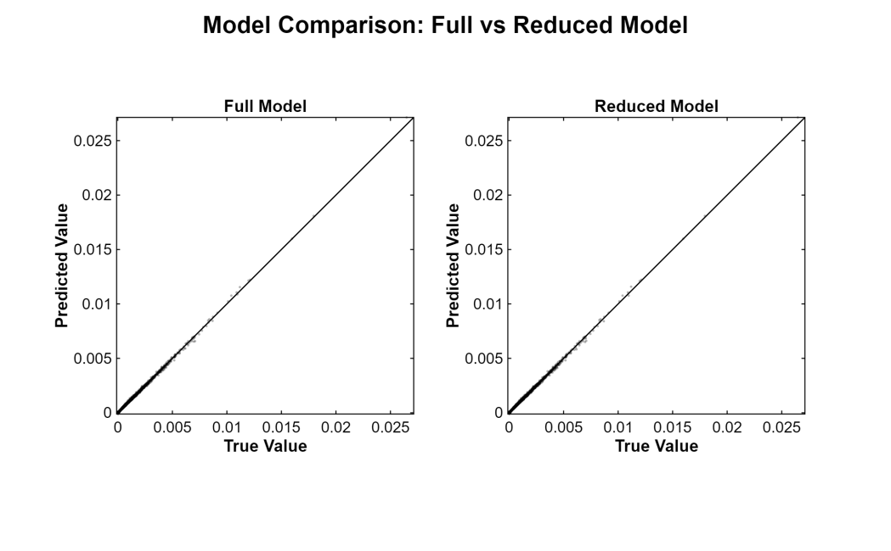
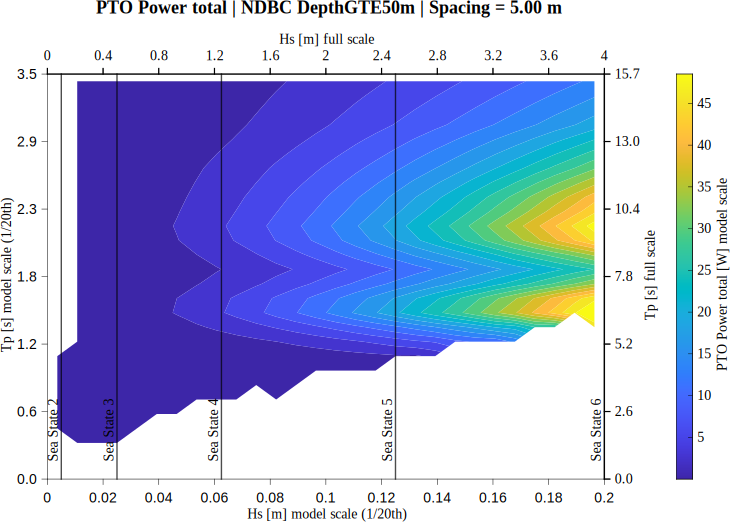
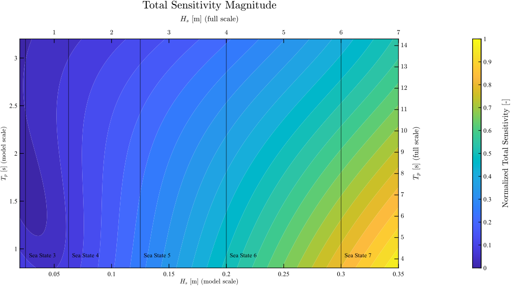

::: {.project-page}

# 2.2 Constructing a Polynomial Surrogate for WEC Array PTO Power

## A reduced-order modeling workflow for predicting PTO response and interpreting sensitivity

::: {.callout-tip appearance="simple"}
## Full report

This page is adapted from the full surrogate-modeling report, available [here](../assets/pdfs/wec-array-final-solo-report.pdf).
:::

## Overview

This project focused on replacing a large physics-based simulation database with a reduced-order surrogate model for PTO total power in a two-device wave energy converter array. The goal was not only to predict power output efficiently, but also to understand how that response changes with wave height, peak period, spacing, and direction.

The report approached that problem in two stages. First, a structured simulation database was built from a WAMIT-based hydrodynamic workflow. Second, that database was used to fit and reduce a polynomial surrogate for PTO total power. The final result was a compact model that preserved the main predictive structure of the simulation-derived response surface while remaining much cheaper to evaluate than the full hydrodynamic workflow. In the full report, that surrogate was then used to interpret PTO total power, array-level capture width, contribution fraction, and derivative-based sensitivity structure over the $(H_s,T_p)$ domain.

## Why a surrogate was needed

A full simulation campaign can map the response of the array over spacing and wave conditions, but it is too expensive to rerun every time a new sea state or interpretation question arises. That is the main motivation for the surrogate: execute the expensive physics-based workflow once, then fit a model that can be evaluated rapidly afterward.

The report states this directly. Rather than rerunning the hydrodynamic pipeline for each new sea state, a representative database was generated first and then used to construct a reduced-order predictive model. In that sense, the surrogate is not separate from the simulation work; it is a computational layer built on top of it.

## Inputs and target quantity

The surrogate was built to predict mean PTO absorbed power as a function of spacing and environmental variables. In the report, the predictor map is written as

$$
P_{\mathrm{PTO}} = f(S, H_s, T_p, \mathrm{Dir}),
$$

where:

- $S$ is device spacing,
- $H_s$ is significant wave height,
- $T_p$ is peak wave period,
- and $\mathrm{Dir}$ is mean wave direction.

The target quantity itself was defined through the PTO damping model. For a linear PTO representation, the report gives the absorbed-power relation as

$$
P_{\mathrm{PTO}} = \frac{1}{2} B_{\mathrm{PTO}} \lvert \dot{x} \rvert^2,
$$

where $B_{\mathrm{PTO}}$ is the PTO damping coefficient and $\dot{x}$ is the device velocity response. That response is not inserted by hand; it comes from the frequency-domain equation of motion used in the upstream hydrodynamic workflow. This matters because it means the surrogate is trained directly on simulation-derived PTO power values rather than on an abstract proxy.

## Standardization and feature construction

Before fitting the regression model, the inputs were standardized. The report writes the standardization in the usual form

$$
z = \frac{x-\mu}{\sigma},
$$

where $\mu$ and $\sigma$ are the mean and standard deviation of each predictor computed from the training data.

Direction was handled with a trigonometric encoding rather than as a raw angle. The input vector used for feature construction was

$$
x =
\begin{bmatrix}
S & H_s & T_p & \cos(\mathrm{Dir}) & \sin(\mathrm{Dir})
\end{bmatrix},
$$

which preserves angular periodicity. A third-order polynomial library was then built from the standardized variables, including all monomials up to total degree three and the associated interaction terms. In the report, the surrogate is written as

$$
P_{\mathrm{PTO}} = \sum_{i=1}^{N_{\mathrm{terms}}} \beta_i \Phi_i(z),
$$

where $\Phi_i(z)$ are the polynomial basis functions and $\beta_i$ are the fitted coefficients.

## Regularization and model reduction

Because the full third-order polynomial library contains many overlapping and correlated terms, the report fit the model using ridge regression. The optimization problem was written as

$$
\hat{\beta}
=
\arg\min_{\beta}
\left(
\lVert y-\Phi\beta\rVert^2 + \lambda \lVert \beta \rVert^2
\right),
$$

where $y$ is the vector of PTO power values and $\Phi$ is the feature matrix. The purpose of the regularization term was to control coefficient magnitude, reduce variance, and stabilize the fit in the presence of multicollinearity.

After fitting the full third-order model, a backward-elimination procedure was used to reduce the library. This is one of the strongest parts of the workflow: the report does not stop at fitting a large polynomial basis, but deliberately trims the model down to retain only the terms that materially affect predictive performance. The final reduced surrogate retained **12 terms** from the original **56-term** third-order polynomial library, with selected ridge parameter $\lambda = 10$.

## Validation and acceptance of the reduced model

The reduced model was evaluated against an independent validation dataset and compared directly with the full polynomial model. The report describes Figure 4 as a parity-style comparison between true simulated PTO power and model-predicted PTO power for both the full and reduced models. The main point of that figure is that the reduced model preserves the predictive behavior of the full model even after most of the terms are removed.

<!-- Full report Figure 4: Comparison between the full polynomial model and the reduced surrogate model -->

The final reduced surrogate was fit on a stratified sampled table containing **444,780 rows** drawn from the North Sea, PWS, and Deep Water NDBC datasets. On the validation set, it achieved

$$
\mathrm{RMSE}_{\mathrm{val}} = 4.01,
\qquad
R^2_{\mathrm{val}} = 0.927.
$$

Those values are strong evidence that the reduced model still captures the dominant structure of the simulation-derived PTO response surface.

## The final reduced model

For reproducibility, the report presents the final surrogate in standardized-input form. The retained basis contains 12 terms and is expressed in the standardized variables associated with

$$
x =
\begin{bmatrix}
H_{s,\mathrm{model}} &
T_{p,\mathrm{model}} &
S &
\sin\beta &
\cos\beta
\end{bmatrix}^{T}.
$$

The retained polynomial structure includes linear, quadratic, and mixed terms, with especially strong dependence on $H_s$, $T_p$, and their interactions. The report emphasizes that the standardized-input representation is the canonical computational form used in fitting and evaluation, while a dimensional-input version can be derived for interpretation and reporting.

## What the surrogate reveals about PTO power

The reduced model was not used only as a fast predictor. It was also used as an interpretation tool over the $(H_s,T_p)$ domain. In the results section, the report shows surrogate-predicted response surfaces for PTO capture width, PTO total power, and contribution fraction under both the NDBC and North Sea datasets.

The response surfaces in the full report include both PTO total power and PTO capture width for the **two-device array**. That distinction matters for interpretation: the reported capture-width quantity is an array-level measure for both WECs together, not a per-device capture width. For a rough single-WEC interpretation at this spacing, the plotted array-level capture width would therefore be divided by two.

A particularly useful figure for the website is the total-power surface. It shows that absolute PTO power grows strongly with wave height and has structured dependence on peak period, including a high-response band around the preferred response region. The report emphasizes that the conditions of highest normalized performance are not identical to those of highest absolute PTO power, which is exactly the kind of distinction the surrogate makes easy to visualize.

<!-- Full report Figure 6: Surrogate-predicted PTO total power over the NDBC domain -->

## Sensitivity as an interpretation tool

One of the strongest aspects of this work is that the surrogate was analyzed with exact derivatives rather than being treated as a black-box regression model. The report defines a span-scaled total sensitivity measure as

$$
S_{\mathrm{tot}} =
\sqrt{
\left(
\left|
\frac{\partial P_{\mathrm{PTO}}}{\partial H_s}
\right|
\Delta H_s
\right)^2
+
\left(
\left|
\frac{\partial P_{\mathrm{PTO}}}{\partial T_p}
\right|
\Delta T_p
\right)^2
+
\left(
\left|
\frac{\partial P_{\mathrm{PTO}}}{\partial S}
\right|
\Delta S
\right)^2
+
\left(
\left|
\frac{\partial P_{\mathrm{PTO}}}{\partial \beta}
\right|
\Delta \beta
\right)^2
}.
$$

This puts derivative contributions with different physical units on a comparable footing before combining them into one total sensitivity magnitude.

The resulting sensitivity maps show that the response surface is most sensitive in the **high-$H_s$, low-$T_p$** portion of the domain. The report also shows that the variable-level balance changes across the domain: some regions are more strongly controlled by wave height, while others are more strongly controlled by peak period.

<!-- Full report Figure 11: Normalized total sensitivity magnitude -->

## Which terms actually matter

The report goes one step further and summarizes sensitivity at the level of individual retained polynomial terms. This is valuable because coefficient magnitude alone does not tell the whole story: some terms can have large coefficients but low derivative-based influence, while others contribute strongly to the response variation over the plotted domain.

The full term-level summary reported in the study is reproduced below. It shows that the dominant contributions come from the **$H_s$-driven terms**, especially the linear $H_s$ term, the quadratic $H_s^2$ term, and the mixed term $H_s^2 T_p$.

| Term | Term label | \|β\| | Mean term total sensitivity | Normalized term sensitivity |
|---:|---|---:|---:|---:|
| 1 | $1$ | 11.170 | 0.000 | 0.000 |
| 2 | $T_p$ | 4.974 | 14.654 | 0.054 |
| 3 | $H_s$ | 12.668 | 67.914 | 0.248 |
| 4 | $T_p \cos\beta$ | 2.066 | 15.698 | 0.057 |
| 5 | $T_p \sin\beta$ | 2.036 | 6.851 | 0.025 |
| 6 | $T_p^2$ | 2.061 | 9.964 | 0.036 |
| 7 | $H_s T_p$ | 3.449 | 24.829 | 0.091 |
| 8 | $H_s^2$ | 3.801 | 66.992 | 0.245 |
| 9 | $T_p \sin\beta \cos\beta$ | 1.107 | 9.609 | 0.035 |
| 10 | $T_p^3$ | 0.857 | 7.324 | 0.027 |
| 11 | $H_s T_p^2$ | 1.367 | 13.909 | 0.051 |
| 12 | $H_s^2 T_p$ | 1.795 | 36.008 | 0.131 |

This table makes the structure of the surrogate much easier to interpret. The derivative-based influence is concentrated primarily in the height-driven terms, which is consistent with the sensitivity maps showing the strongest response in the high-$H_s$, low-$T_p$ region of the domain.

## Why this matters

The main value of this surrogate is not only speed. It is that it preserves a useful connection between high-fidelity simulation and interpretable reduced-order structure.

The workflow starts with a large hydrodynamic simulation database, compresses that database into a reduced 12-term polynomial model, validates that reduction against held-out data, and then extracts derivative-based sensitivity information from the final fit. That makes the model useful in two ways at once:

- as a fast predictor of PTO response,
- and as a compact analytical description of how that response varies across the sea-state domain.

In that sense, the surrogate is not just a machine-learning shortcut. It is a structured mathematical model built from simulation data and then used to interpret the response surface itself.

## Closing note

This project represents the data-analysis layer of the broader WEC-array workflow. The upstream hydrodynamic simulations provide the response database, and the surrogate turns that database into a reduced-order predictive and interpretive model.

For the website, that makes it a particularly strong example of scientific computing: it combines simulation, regression, model reduction, validation, and sensitivity analysis in one coherent pipeline. The result is a model that is both computationally efficient and physically interpretable.

:::