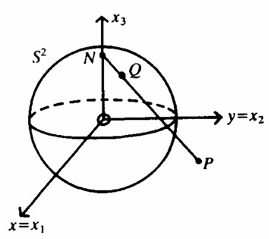
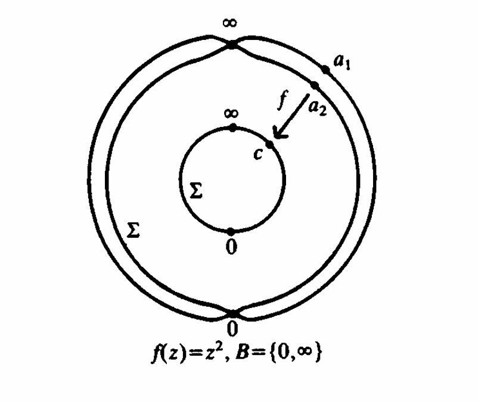

::: {.project-page}

# 4.1 Mathematical Bridges: Complex Functions, Algebra, and Geometry

## A web adaptation of an expository paper on the Riemann sphere, rational maps, and Möbius transformations

::: {.callout-tip appearance="simple"}
## Full paper

This page presents a condensed web version of the full expository paper.

[Download the full paper](../assets/pdfs/mathematical-bridges.pdf)
:::

## Overview

This exposition develops a single geometric idea and follows its algebraic consequences: once the complex plane is compactified by a point at infinity, it becomes the Riemann sphere. On that compact surface, meromorphic functions acquire a particularly rigid structure. The central result is that every meromorphic function on the sphere is rational, and the degree of that rational map controls how the sphere covers itself. In the special degree-one case, the resulting automorphisms are precisely the Möbius transformations [@jones1987complex; @saff2014fundamentals].

The full paper was written as a bridge between three viewpoints that are often learned separately:

- complex functions as analytic objects
- rational maps as algebraic objects
- sphere automorphisms as geometric objects

What makes the subject compelling is that these are not merely analogous descriptions. On the Riemann sphere, they are different descriptions of the same mathematical structure.

## From the complex plane to the sphere

The first key step is to adjoin a point at infinity to the complex plane,

$$
\Sigma = \mathbb{C} \cup \{\infty\}.
$$

Geometrically, this compactification is realized by stereographic projection from the unit sphere

$$
S^2 = \{(x_1,x_2,x_3) \in \mathbb{R}^3 : x_1^2+x_2^2+x_3^2 = 1\}.
$$

If $N=(0,0,1)$ is the north pole and $Q=(x_1,x_2,x_3) \in S^2 \setminus \{N\}$ projects to the complex-plane point $P=(x,y,0)$, then the stereographic map is

$$
x = \frac{x_1}{1-x_3},
\qquad
y = \frac{x_2}{1-x_3}.
$$

Its inverse is

$$
x_1 = \frac{2x}{x^2+y^2+1},
\qquad
x_2 = \frac{2y}{x^2+y^2+1},
\qquad
x_3 = \frac{x^2+y^2-1}{x^2+y^2+1}.
$$

These formulas do more than supply coordinates. They identify the extended complex plane with a compact geometric object, allowing analytic questions about complex functions to be studied on a sphere rather than on an unbounded plane.

{fig-alt="Stereographic projection from the Riemann sphere to the complex plane" fig-align="center" width="42%"}

## Why compactification changes the problem

The point at infinity is not an afterthought. It changes the global behavior of complex functions.

On the ordinary complex plane, a meromorphic function may have poles at finite points and still behave badly at infinity. On the sphere, infinity is just another point, so one can ask whether a function remains meromorphic there as well. This produces a much cleaner global theory.

A useful auxiliary map is inversion,

$$
J(z)=\frac{1}{z},
\qquad
J(0)=\infty,
\qquad
J(\infty)=0,
$$

which exchanges $0$ and $\infty$. It allows local behavior near infinity to be studied by converting it into local behavior near the origin. In that sense, the sphere treats all points on equal footing.

## Meromorphic on the sphere means rational

Once the sphere is the ambient space, a remarkable rigidity theorem appears:

::: {.callout-important appearance="simple"}
## Central result

Every meromorphic function on the Riemann sphere is a rational function.
:::

This is one of the main structural results of the paper. Intuitively, compactness eliminates the possibility of infinitely many uncontrolled singularities. A meromorphic function on $\Sigma$ can only have finitely many poles, and after factoring those poles out, the remaining function is holomorphic on the sphere. A holomorphic function on a compact Riemann surface of genus zero is extremely constrained, which forces the global form to be rational [@jones1987complex].

So if $f$ is meromorphic on $\Sigma$, then

$$
f(z) = \frac{p(z)}{q(z)},
$$

for polynomials $p$ and $q$ with no common factor.

This theorem is the hinge point of the exposition. It turns the study of analytic maps on the sphere into the study of algebraic maps, and from there geometric interpretations become available.

## Degree and branched covering behavior

If

$$
f(z)=\frac{p(z)}{q(z)}
$$

is written in lowest terms, its degree is

$$
\deg(f)=\max\{\deg p,\deg q\}.
$$

That degree has direct geometric meaning. A rational map of degree $k$ acts as a $k$-fold branched covering of the sphere: away from finitely many branch values, a typical point has exactly $k$ preimages counted with multiplicity.

The simplest nontrivial example is

$$
f(z)=z^2.
$$

Viewed as a map $\Sigma \to \Sigma$, it is generically two-to-one. The exceptional behavior occurs at the branch points $0$ and $\infty$, where the local multiplicity changes. This gives a concrete model for how analytic multiplicity becomes topological covering behavior.

{fig-alt="Branched covering of the sphere induced by z squared" fig-align="center" width="78%"}

## The degree-one case: Möbius transformations

The degree-one rational maps are exactly the Möbius transformations,

$$
T(z)=\frac{az+b}{cz+d},
\qquad a,b,c,d \in \mathbb{C},
\qquad ad-bc \neq 0.
$$

These are the automorphisms of the Riemann sphere. They are precisely the meromorphic bijections $\Sigma \to \Sigma$, so the geometry of the sphere and the algebra of $2\times 2$ complex matrices become tightly linked.

Several familiar operations appear as special cases:

- rotations: $R_\theta(z)=e^{i\theta}z$
- dilations: $S_r(z)=rz$
- translations: $T_t(z)=z+t$
- inversion: $J(z)=1/z$

One of the key takeaways of the paper is that these basic operations generate the full Möbius group. In other words, the entire automorphism group of the sphere can be built from a small collection of geometrically meaningful maps.

## Group structure and projective linear algebra

A Möbius transformation can be represented by the matrix

$$
M =
\begin{pmatrix}
 a & b \\
 c & d
\end{pmatrix},
$$

with nonzero determinant. Composition of transformations corresponds to matrix multiplication, up to multiplication by a nonzero scalar. This leads to the identification

$$
\operatorname{Aut}(\Sigma) \cong PGL(2,\mathbb{C}),
$$

where $PGL(2,\mathbb{C})$ is the projective general linear group.

This is the clearest point at which the three themes of the paper meet:

- analytically, these maps are meromorphic bijections
- algebraically, they are projective linear transformations
- geometrically, they are the symmetries of the Riemann sphere preserving generalized circles

That last point is especially important. Möbius transformations send circles and lines in the extended plane to circles and lines again, where lines are interpreted as circles through infinity. This is one of the reasons they appear so naturally across complex analysis, geometry, and dynamical systems.

## Why this makes a good expository subject

This paper was designed to emphasize mathematical continuity rather than isolated results. A student may first encounter analytic functions in a complex analysis course, matrices in linear algebra, and projective geometry in the context of physics. The Riemann sphere shows that these ideas have deep and important connections.

The overall progression is

$$
\text{compactification}
\;\longrightarrow\;
\text{meromorphic functions}
\;\longrightarrow\;
\text{rational maps}
\;\longrightarrow\;
\text{Möbius transformations and } PGL(2,\mathbb{C}).
$$

## Selected references

The full paper contains a more complete bibliography. The sources that most directly shaped this exposition are Jones and Singerman (1987) for the algebraic-geometric viewpoint, Saff and Snider (2014) for background complex analysis, Needham (2023) for visual intuition, and Bottazzini (1986) for historical context.

- Bottazzini, Umberto. *The Higher Calculus: A History of Real and Complex Analysis from Euler to Weierstrass*. Springer-Verlag, 1986.
- Jones, Gareth A., and David Singerman. *Complex Functions: An Algebraic and Geometric Viewpoint*. Cambridge University Press, 1987.
- Needham, Tristan. *Visual Complex Analysis*. 25th Anniversary ed. Oxford University Press, 2023.
- Saff, Edward B., and Arthur David Snider. *Fundamentals of Complex Analysis with Applications to Engineering, Science, and Mathematics*. 3rd ed. Pearson, 2014.

::: {.callout-note appearance="simple"}
## Website note

This page is intentionally shorter than the full manuscript. For the full story, including detailed proofs of all theorems please download the PDF.
:::

:::
