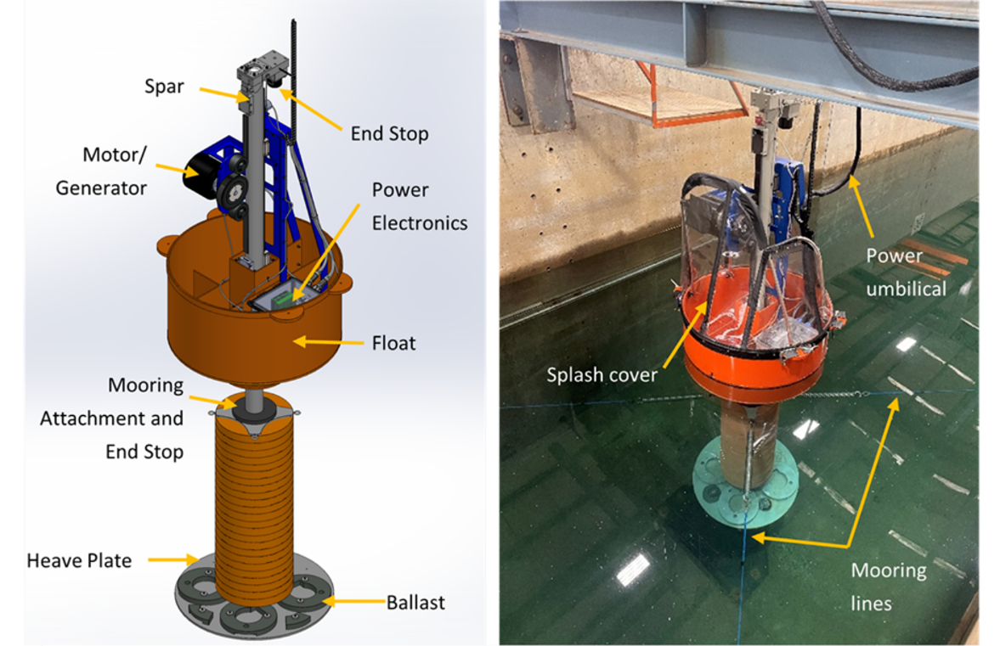
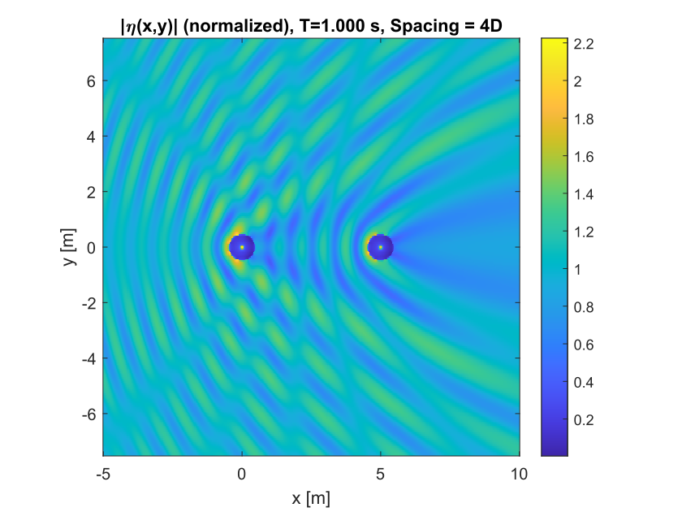
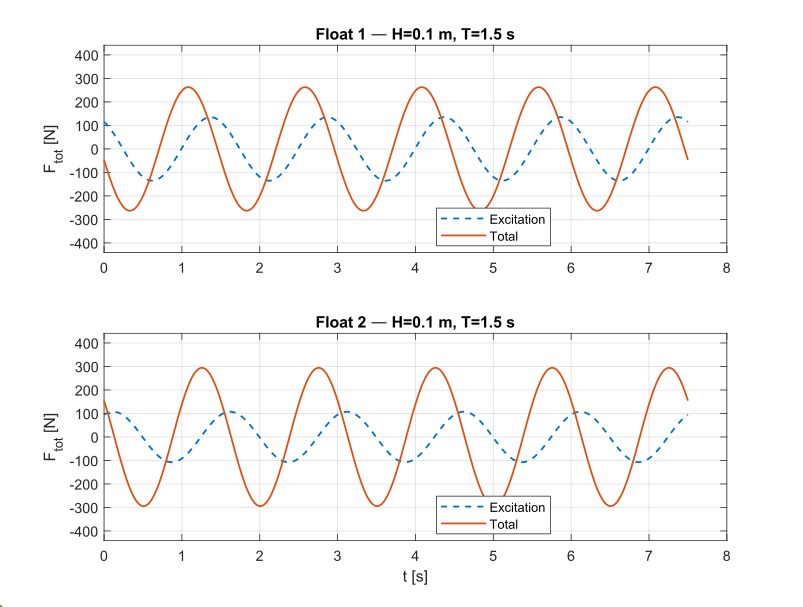
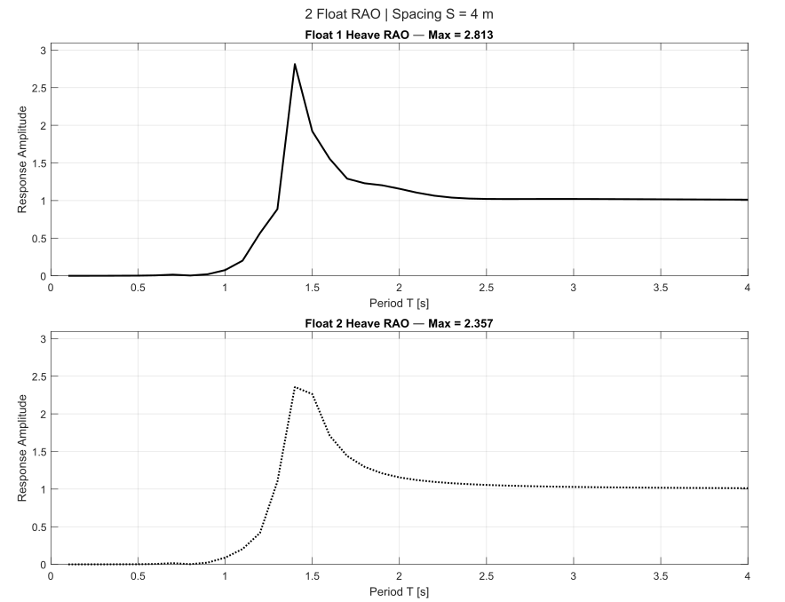

::: {.project-page}

# 3.1 Simulating Wave Energy Converter Arrays in WAMIT

## A physics-based simulation workflow for modeling array hydrodynamics and wave-body interactions

::: {.callout-tip appearance="simple"}
## Full report

This page is adapted from the full array-modeling report, available [here](../assets/pdfs/wec-array-final-solo-report.pdf).
:::

## Overview

This project focused on simulating a two-device wave energy converter array using a physics-based hydrodynamic workflow. The aim was not only to model the response of a single device, but to resolve how nearby devices modify one another through wave scattering, shadowing, and array interaction.

The simulation framework was built around WAMIT, a frequency-domain potential-flow solver widely used for linear wave-body interaction problems. In this study, WAMIT was used to generate the hydrodynamic response database that later supported reduced-order surrogate modeling. The result was a workflow that began with device geometry, passed through hydrodynamic coefficient generation, and ended with a structured simulation database over spacing and environmental conditions.

## Why WAMIT was used

For array studies, the main challenge is not only computing how one body responds to waves, but how bodies interact through the surrounding fluid field. That requires a framework that can capture excitation, radiation, and wave scattering consistently over many wave conditions.

In the report, the simulation database was constructed from a **WAMIT-based hydrodynamic model of a two-device wave energy converter array**. The geometry was first built in Blender using device measurements, then prepared for WAMIT so the required frequency-domain hydrodynamic coefficients could be computed. Those coefficients supplied the linear interaction quantities needed to describe the coupled array response. 

## Geometry and simulation setup

The workflow began by defining the WEC geometry in Blender. The purpose of that step was to reproduce the device dimensions closely enough that the hydrodynamic model would be tied to a physically meaningful configuration rather than to an abstract shape.

Once the geometry was prepared, the model was transferred into WAMIT for frequency-domain analysis. The report describes this step as the point where the simulation begins producing the coefficients needed to characterize excitation, radiation, and the surrounding wave field. In other words, WAMIT acts as the engine that converts geometry and wave conditions into the hydrodynamic data needed for downstream interpretation and modeling. 

## What the wave field reveals

One of the clearest outputs from the WAMIT workflow is the surrounding wave field itself. That output is useful because it shows, directly and visually, how the presence of one device alters the incident environment of the other.

The report’s representative WAMIT wave-field figure highlights two features in particular:

- the two-device configuration itself,
- and the resulting shadowing and scattering structure in the surrounding field.

This matters because the array problem is not just two isolated single-body problems placed side by side. The local wave environment of each device is modified by the other, and that interaction affects the response that is ultimately recorded in the simulation database. 

<!-- Full report Figure 3: Representative WAMIT wave-field output -->

## Dynamic response and phase structure

The hydrodynamic simulation is valuable not only because it generates coefficients, but because it helps explain how multiple bodies move relative to one another under wave forcing. In a two-device array, the relative timing of motions and forces matters: even when the devices are nominally similar, their responses can differ because each body experiences a wave environment modified by the other.

That phase structure is one of the reasons array modeling is interesting. Motion histories can show that the two floats do not simply move in lockstep. Instead, the combination of spacing, frequency, and interaction effects creates phase differences and force differences across the array.

## The frequency-domain point of view

Because WAMIT is a frequency-domain solver, one of the most natural ways to interpret the results is through response amplitude operators. An RAO compresses the response information into a frequency-dependent transfer relationship, making it easier to see where the device is most responsive and how that response changes across conditions.

This frequency-domain viewpoint is especially useful in early-stage modeling because it separates the wave-response structure from the later climatological and surrogate layers. Before asking where a site spends most of its time in \((H_s,T_p)\) space, or before fitting a reduced-order model, it is valuable to understand how the device responds as a hydrodynamic system.

## From simulation campaign to database

The WAMIT results were not treated as isolated case studies. Instead, the report describes how they were used to populate a structured simulation database over the parameter space

$$
(S, H_s, T_p, \mathrm{Dir}).
$$

By repeating the hydrodynamic modeling workflow over a selected grid in spacing and wave conditions, the study produced a lookup table of modeled array response. That database then became the foundation for later reduced-order modeling. This is an important design choice: rather than rerunning the full physics-based workflow for every new sea state, the simulation campaign is executed once to build a reusable dataset. 

## Why this matters for array modeling

The main contribution of the WAMIT stage is not just that it produces visually appealing wave fields. Its real value is that it encodes the physics of array interaction into a reusable response database.

That database carries several layers of information at once:

- device geometry,
- hydrodynamic coupling,
- scattering and shadowing effects,
- and dependence on spacing and wave conditions.

Because of that, it can support later stages of analysis without losing the physical structure of the underlying simulation. In this project, that meant the WAMIT results could be reused to build a surrogate model for PTO power rather than forcing every downstream analysis to rerun the full hydrodynamic workflow. 

## Closing note

This project represents the physics-based simulation layer of the broader WEC-array workflow. It starts from device geometry, moves through WAMIT-based hydrodynamic modeling, and produces a structured database that resolves how a two-device array interacts with the surrounding wave field.

In that sense, the page is about more than just one solver. It shows how a frequency-domain hydrodynamic model can serve as the backbone of a larger modeling pipeline: one that begins with first-principles wave-body interaction and later supports reduced-order prediction, performance mapping, and environmental interpretation.

:::