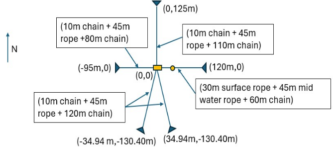
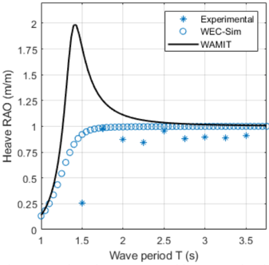
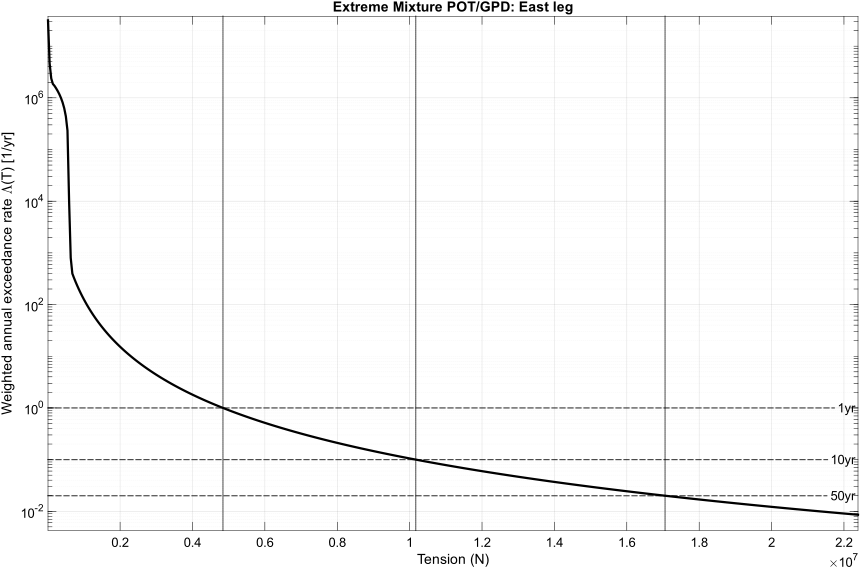
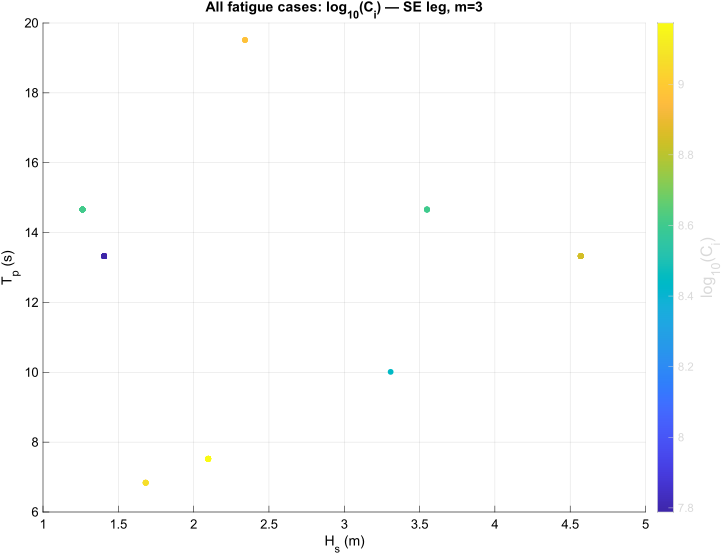

::: {.project-page}

# 1.2 Mooring Line Load Prediction and Anchor Sensitivity for PacWave South

::: {.callout-tip appearance="simple"}
## Full report

This page is adapted from the full Task 3 research report, available [here](../assets/pdfs/pacwave-task3-report.pdf).
:::

## Overview

This project focused on predicting long-term mooring loads for a PacWave South deployment using coupled time-domain simulation and statistical postprocessing. The core workflow combined WEC-Sim body dynamics with MoorDyn mooring dynamics, then reduced the resulting tension histories into two engineering outputs: extreme-load return levels and fatigue-governing sea states.

Rather than treating mooring analysis as a purely geometric or static problem, the study used representative irregular sea states, retained dynamic tension histories for each mooring leg, and then screened those histories in two complementary ways. Extreme loads were estimated through a weighted peaks-over-threshold framework, while fatigue-relevant loading was mapped over sea-state space using rainflow-based proxy metrics. The result was a compact design-oriented picture of which mooring legs and which sea states matter most.

<!-- Full report Figure 2: Ocean Sentinel Proposed Mooring Line Configuration -->

## Why this problem matters

For a wave-energy deployment, the mooring system is part of the device, not just a boundary condition. Extreme tensions affect survivability, while repeated load cycling controls long-term fatigue demand. A useful mooring study therefore has to do more than simulate a few representative cases: it has to connect the long-term sea-state climate to a manageable set of design-relevant load measures.

That is the motivation for this page. The report’s contribution is not just a set of simulations, but a way to translate many weighted sea states into a small number of governing tensions and governing conditions for follow-on design checks.

## Mooring model and simulation context

The baseline mooring model used a lumped-mass mooring line method, in which each line is represented as discrete masses connected by elastic-damped segments. In the report, the dynamic equilibrium of each lumped mass is written as

$$
m_i \ddot{r}_i = T_{i+1} - T_i + F_{\mathrm{ext},i}.
$$

This is the modeling step that converts the continuous cable problem into a tractable time-domain system while still retaining large displacement effects, nonlinear geometry, and transient load behavior. The report emphasizes that this approach is widely used for floating offshore platforms, floating wind, and wave-energy systems because it balances physical fidelity with computational practicality.

The numerical study then coupled WEC-Sim with MoorDyn for a five-leg system comprising North, East, Southeast, Southwest, and West mooring legs. The representative sea-state set was simulated at fixed time step, and a 180 s initial transient was removed before load analysis.

## Validation and real-device context

Before moving to the PacWave mooring study, the broader simulation workflow was validated using the Laboratory Upgrade Point Absorber (LUPA), an experimentally tested wave-energy converter. The report explains that LUPA was used because the Ocean Sentinel deployment had been delayed, so a recent open-source experimental platform was needed for validation. It also notes that the LUPA validation included RAO comparison work in WAMIT and WEC-Sim.

<!-- Full report Figure 4: LUPA Simulation and laboratory RAO -->

A compact version of the lab-to-full-scale parameter comparison is useful here because it shows the research sits in the context of a physically realized WEC platform rather than a purely abstract numerical model. The values below are adapted from Table 2 in the report.

### LUPA scale comparison

  

  

    Comparison of physical parameters between laboratory scale and full scale.
  

  <table style="
    border-collapse: collapse;
    margin: 0 auto;
    font-size: 0.98rem;
    line-height: 1.35;
    min-width: 760px;
  ">
    <thead>
      <tr style="border-top: 2px solid #222; border-bottom: 1px solid #222;">
        <th colspan="3" style="padding: 0.55rem 1rem; font-weight: 700; text-align: center;">Lab Scale</th>
        <th colspan="3" style="padding: 0.55rem 1rem; font-weight: 700; text-align: center;">Full Scale</th>
      </tr>
      <tr style="border-bottom: 1px solid #222;">
        <th style="padding: 0.55rem 1rem; font-weight: 700; text-align: left;">Parameter</th>
        <th style="padding: 0.55rem 1rem; font-weight: 700; text-align: right;">Value</th>
        <th style="padding: 0.55rem 1rem; font-weight: 700; text-align: left;">Units</th>
        <th style="padding: 0.55rem 1rem; font-weight: 700; text-align: left;">Parameter</th>
        <th style="padding: 0.55rem 1rem; font-weight: 700; text-align: right;">Value</th>
        <th style="padding: 0.55rem 1rem; font-weight: 700; text-align: left;">Units</th>
      </tr>
    </thead>
    <tbody>
      <tr>
        <td style="padding: 0.45rem 1rem; text-align: left;">Float mass</td>
        <td style="padding: 0.45rem 1rem; text-align: right;">248.7</td>
        <td style="padding: 0.45rem 1rem; text-align: left;">kg</td>
        <td style="padding: 0.45rem 1rem; text-align: left;">Float mass</td>
        <td style="padding: 0.45rem 1rem; text-align: right;">1,989,760.0</td>
        <td style="padding: 0.45rem 1rem; text-align: left;">kg</td>
      </tr>
      <tr>
        <td style="padding: 0.45rem 1rem; text-align: left;">Float diameter</td>
        <td style="padding: 0.45rem 1rem; text-align: right;">1.0</td>
        <td style="padding: 0.45rem 1rem; text-align: left;">m</td>
        <td style="padding: 0.45rem 1rem; text-align: left;">Float diameter</td>
        <td style="padding: 0.45rem 1rem; text-align: right;">20.0</td>
        <td style="padding: 0.45rem 1rem; text-align: left;">m</td>
      </tr>
      <tr>
        <td style="padding: 0.45rem 1rem; text-align: left;">Float draft</td>
        <td style="padding: 0.45rem 1rem; text-align: right;">0.4</td>
        <td style="padding: 0.45rem 1rem; text-align: left;">m</td>
        <td style="padding: 0.45rem 1rem; text-align: left;">Float draft</td>
        <td style="padding: 0.45rem 1rem; text-align: right;">8.8</td>
        <td style="padding: 0.45rem 1rem; text-align: left;">m</td>
      </tr>
      <tr>
        <td style="padding: 0.45rem 1rem; text-align: left;">Spar mass</td>
        <td style="padding: 0.45rem 1rem; text-align: right;">175.5</td>
        <td style="padding: 0.45rem 1rem; text-align: left;">kg</td>
        <td style="padding: 0.45rem 1rem; text-align: left;">Spar mass</td>
        <td style="padding: 0.45rem 1rem; text-align: right;">1,404,320.0</td>
        <td style="padding: 0.45rem 1rem; text-align: left;">kg</td>
      </tr>
      <tr>
        <td style="padding: 0.45rem 1rem; text-align: left;">Spar heave plate diameter</td>
        <td style="padding: 0.45rem 1rem; text-align: right;">0.9</td>
        <td style="padding: 0.45rem 1rem; text-align: left;">m</td>
        <td style="padding: 0.45rem 1rem; text-align: left;">Spar heave plate diameter</td>
        <td style="padding: 0.45rem 1rem; text-align: right;">18.0</td>
        <td style="padding: 0.45rem 1rem; text-align: left;">m</td>
      </tr>
      <tr>
        <td style="padding: 0.45rem 1rem; text-align: left;">Spar total height</td>
        <td style="padding: 0.45rem 1rem; text-align: right;">3.7</td>
        <td style="padding: 0.45rem 1rem; text-align: left;">m</td>
        <td style="padding: 0.45rem 1rem; text-align: left;">Spar total height</td>
        <td style="padding: 0.45rem 1rem; text-align: right;">74.0</td>
        <td style="padding: 0.45rem 1rem; text-align: left;">m</td>
      </tr>
      <tr style="border-bottom: 2px solid #222;">
        <td style="padding: 0.45rem 1rem; text-align: left;">Spar draft</td>
        <td style="padding: 0.45rem 1rem; text-align: right;">2.1</td>
        <td style="padding: 0.45rem 1rem; text-align: left;">m</td>
        <td style="padding: 0.45rem 1rem; text-align: left;">Spar draft</td>
        <td style="padding: 0.45rem 1rem; text-align: right;">41.0</td>
        <td style="padding: 0.45rem 1rem; text-align: left;">m</td>
      </tr>
    </tbody>
  </table>

  

## Conservative leg-level load definition

For each simulation, MoorDyn recorded fairlead and anchor tensions on the relevant mooring segments. To produce a conservative per-leg signal suitable for screening, the report defined leg tension as

$$
T(t) = \max\!\left(T_{\mathrm{fair}}(t),\; T_{\mathrm{anch}}(t)\right).
$$

This is an important modeling choice because it lets the later extreme-value and fatigue analysis operate on one leg-level time history instead of treating fairlead and anchor channels separately. It is also one of the cleanest examples of the report’s overall design philosophy: simplify only after the dynamic simulation has already captured the relevant physics.

## Extreme load prediction

The report used a weighted peaks-over-threshold framework to estimate long-term extreme tensions. For each sea state, exceedances above a high threshold were modeled with a Generalized Pareto Distribution, and then the sea-state-specific tails were combined using long-term occurrence weights.

The weighted annual exceedance-rate curve was written as

$$
\Lambda(T)
=
\sum_i \lambda_i \,
\Pr\!\left(Y_i > T-u_i \mid Y_i > 0\right),
$$

and the return levels were defined implicitly by

$$
\Lambda(T_R) = \frac{1}{R},
\qquad
R \in \{1,10,50\}\ \text{years}.
$$

These equations matter because they are what connect short simulated records to engineering-scale design quantities like 10-year and 50-year return tensions. The report interprets smaller values of $\Lambda(T)$ as rarer, more extreme loads, and uses the resulting intersections to identify design-relevant tensions by leg.

<!-- Full report Figure 10: Weighted annual exceedance-rate curve for the East mooring leg -->

Among the legs with internally consistent scaling, the East leg governed the extreme response. The report lists return levels of $T_1 = 4.8419$ MN, $T_{10} = 10.1681$ MN, and $T_{50} = 17.0576$ MN for that leg, while also flagging the West-leg result as likely nonphysical because it was identical across return periods and orders of magnitude larger than the others.

## Fatigue screening and sea-state concentration

The second major output of the study was fatigue screening. For each sea state and leg, rainflow counting was applied to the conservative tension signal, and annualized contribution metrics were formed from the range moments and the long-term sea-state weights. The report defines the moment-based proxy by

$$
M_i(m) = \sum_j n_j (\Delta T_j)^m,
$$

and then ranks sea states by their weighted annualized contribution

$$
C_i(m)
=
w_i
\left(\frac{T_{\mathrm{yr}}}{T_{\mathrm{sim},i}}\right)
M_i(m).
$$

This turns a large representative sea-state set into something interpretable: a ranked map of which conditions actually dominate the annualized fatigue proxy.

<!-- Full report Figure 12: Fatigue sea-state contribution map for the SE mooring leg -->

One of the clearest results in the report is that fatigue contribution is highly concentrated. Across all legs, the sea state $(H_s,T_p)=(2.10, 7.52)$ dominates the annualized fatigue-proxy contribution, accounting for roughly 63–78% of the total depending on leg. The report also shows that only 2–3 unique sea states are needed to reach 80% cumulative contribution for every leg, and that this ranking is essentially unchanged between the $m=3$ and $m=5$ fatigue exponents.

## What this changed in the design picture

The value of the study is not only that it produced return levels and rankings. It also demonstrated that the long-term mooring problem can be reduced to a compact set of governing conditions without losing the main design signal.

For extremes, that signal is the East leg and its return-level curve. For fatigue, that signal is the concentration of annualized contribution into a very small number of sea states. This means a follow-on campaign does not need to treat every representative case as equally important. The report explicitly recommends a reduced-set interpretation in which the dominant sea state $(2.10,7.52)$ is always included and one or two additional cases are added as needed to reach a target cumulative coverage threshold such as 80%.

## Closing note

This project connects mooring dynamics, statistical postprocessing, and device-scale simulation in a way that is directly useful for engineering decisions. It shows how to move from many weighted irregular sea states to a small set of governing load cases, and it frames mooring analysis as both an extreme-value problem and a fatigue-screening problem.

Just as importantly for the broader research program, it also sits in continuity with experimental WEC work through the LUPA validation pathway. That connection helps place the mooring analysis within a larger, physically grounded workflow rather than as an isolated numerical exercise.

:::