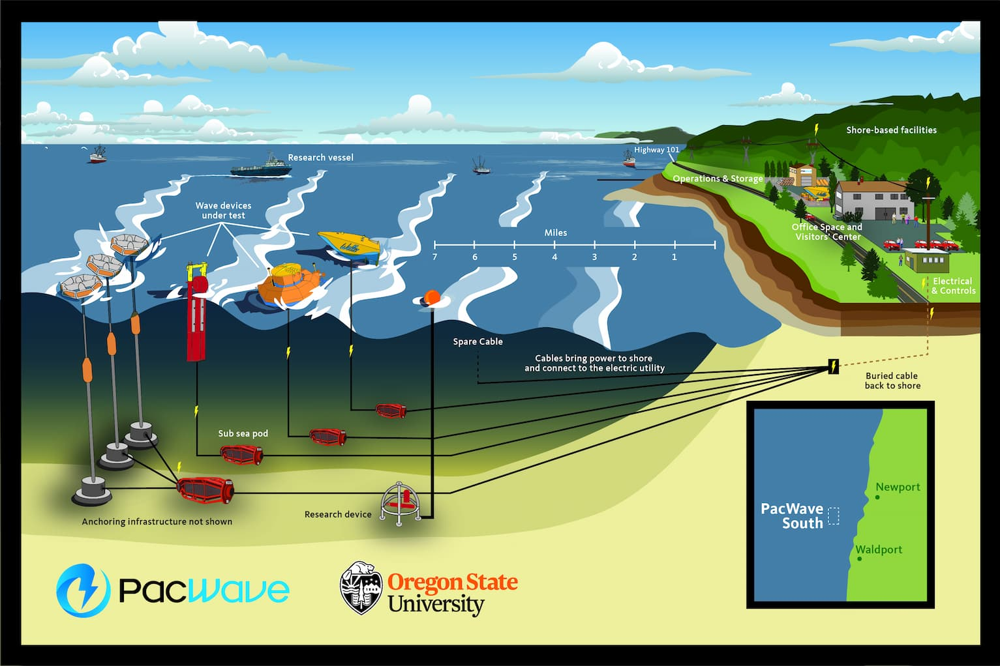
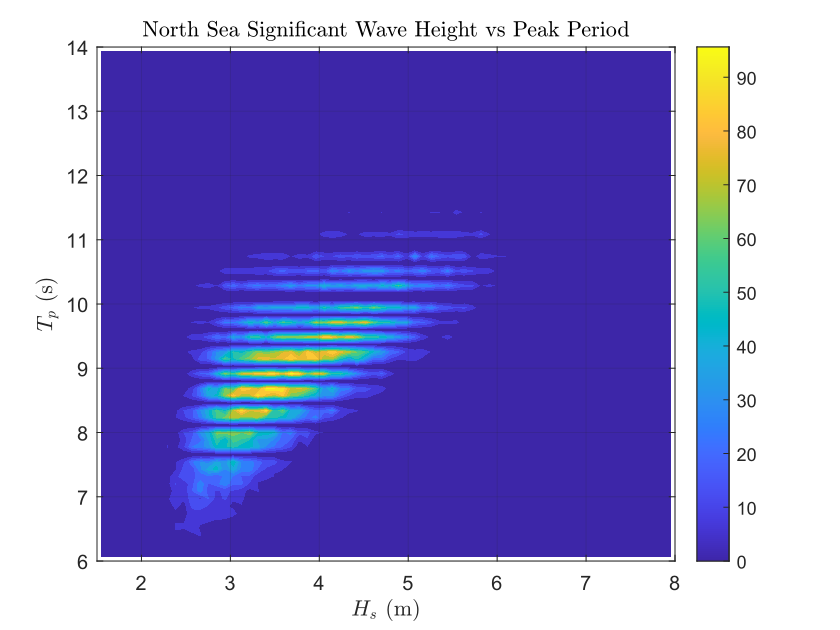
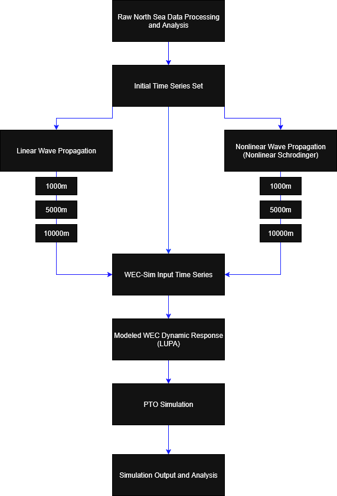
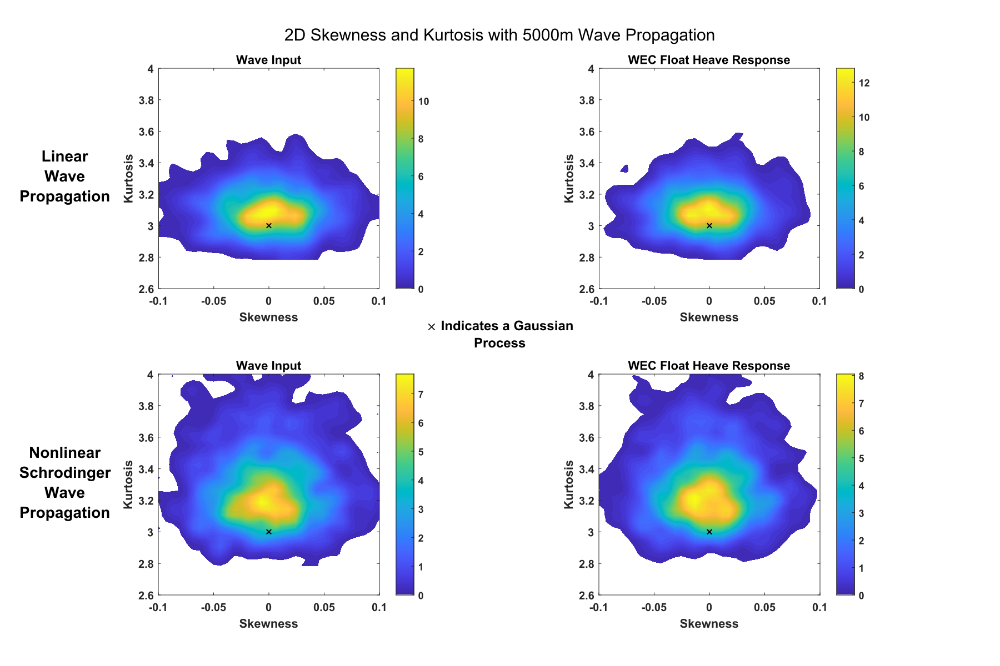
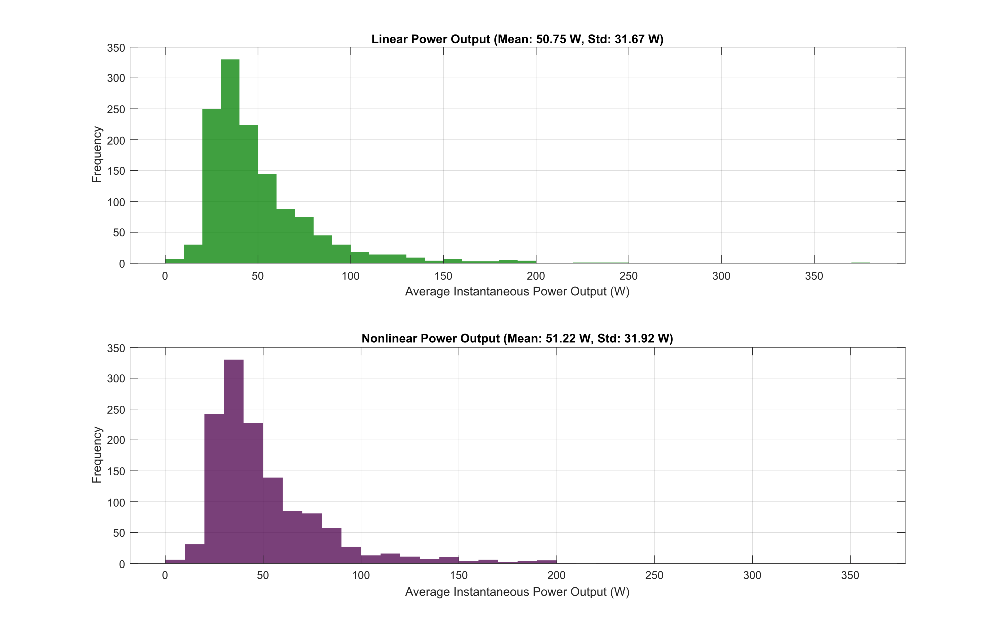

::: {.project-page}

# 1.1 Nonlinear Wave Propagation and Structural Response Analysis for PacWave South

::: {.callout-tip appearance="simple"}
## Full report

This page is adapted from the full Task 4 research report, available [here](../assets/pdfs/pacwave-task4-report.pdf).
:::

## Overview

This project examined how nonlinear wave propagation changes the statistical character of ocean-wave forcing and how those changes carry through into wave energy converter response. The motivating question was practical: if a device is simulated with a standard linear wave model, what behavior is missed when the true sea state contains stronger non-Gaussian structure?

The report addressed that question in three stages. First, it characterized the PacWave South site and compared available wave datasets. Second, it selected an appropriate nonlinear propagation model for PacWave-like conditions. Third, it propagated measured wave time series under both linear and nonlinear models, used those wave fields as forcing in WEC-Sim, and compared the resulting device response.

The main conclusion was not that nonlinear modeling dramatically changes mean absorbed power. Instead, the report showed something more targeted and more important for design: nonlinear propagation preserves elevated kurtosis and makes extreme wave events more common, and those changes are reflected in the WEC response as well.

<!-- Full report Figure 1: PacWave South Testing Site -->

## Why this problem matters

For wave energy systems, average behavior is only part of the design problem. Mooring loads, structural excursions, and survivability are strongly influenced by rare events and heavy-tailed response statistics. A model that reproduces the mean response while underrepresenting extremes can still be inadequate for engineering decisions.

That is why the report focused on skewness, kurtosis, and extreme-event probability rather than only on mean quantities. The project’s core argument was that nonlinearity matters not because it necessarily changes the average sea state, but because it changes the distribution of events around that average.

## Site characterization and data selection

The work began with PacWave South, a grid-connected open-ocean test site offshore of Newport, Oregon. The report then compared three wave-data sources:

- PacWave Spotter buoy data
- regional hindcast data
- Ekofisk North Sea laser-altimeter time series

The key distinction was that the Spotter and hindcast products primarily provided wave statistics or spectra, while the North Sea record provided raw measured time series. Because the project needed model-independent time histories that could be propagated under both linear and nonlinear assumptions, the North Sea dataset was selected as the most useful forcing source.

A major part of the study was therefore not just simulation, but choosing a forcing dataset that preserved the information needed to test nonlinear evolution properly.

<!-- Full report Figure 11: Contour Plot of Hs and Tp for the Ekofisk North Sea data for 2002–2020 -->

## Why a nonlinear model was needed

A central point of the report is that spectra and bulk statistics already carry modeling assumptions. In particular, standard linear random-wave analysis assumes that the free surface can be represented as a superposition of sinusoids,

$$
\eta(t) = \sum_{i=1}^{\infty} a_i \sin(\omega_i t + \phi_i).
$$

That assumption is useful, but it also fixes the statistical structure of the wave field. Under the linear framework, amplitude statistics are taken to be Gaussian, and wave-height statistics become Rayleigh-distributed. The report used this as the baseline against which nonlinear behavior was compared.

From there, the project considered two nonlinear models:

- the Korteweg–de Vries equation for shallow-water behavior
- the nonlinear Schrödinger equation for deep to intermediate water

The final model choice was based on PacWave-like wave conditions, bandwidth, and depth regime. The report concluded that the nonlinear Schrödinger equation was the better choice because PacWave South conditions lie mainly in the deep-to-intermediate range and are approximately narrow-banded.

The NLS envelope equation was written in the report as

$$
i(\psi_t + C_g \psi_x) + \mu \psi_{xx} + \nu |\psi|^2 \psi = 0.
$$

Here, $\psi$ is the wave envelope, $C_g$ is the group velocity, and the nonlinear term $|\psi|^2 \psi$ allows the model to preserve effects that are absent in a purely linear propagator.

## Simulation workflow

Once the data source and wave model were selected, the workflow moved from site characterization to device simulation.

The North Sea records were first segmented into approximately 54-minute windows. That duration was chosen to preserve enough waves to estimate skewness and kurtosis reliably while also matching a power-of-two record length for FFT-based processing. Each time series was then propagated at a sequence of distances using both linear and nonlinear evolution models.

Those propagated wave records were used as forcing functions in WEC-Sim for a LUPA point absorber, with analysis focused on float heave response. The device model also included a peak-period-based PTO damping scheme, so the workflow connected wave statistics, device dynamics, and absorbed power within one simulation chain.

<!-- Full report Figure 18: Data qualification and simulation process -->

## Statistical metrics used in the comparison

The report used skewness and kurtosis as the main low-order indicators of non-Gaussian behavior. Skewness was used to measure asymmetry in the free-surface distribution, while kurtosis measured tail heaviness and concentration around the mean.

The skewness was defined as

$$
s
=
\frac{\mathbb{E}[(\eta-\mu)^3]}{\sigma^3},
$$

and the kurtosis as

$$
\kappa
=
\frac{\mathbb{E}[(\eta-\mu)^4]}{\sigma^4}.
$$

For a Gaussian process, the skewness is zero and the kurtosis is three. In practice, the report emphasized that elevated kurtosis is especially important because it indicates a greater likelihood of large-magnitude events.

The project then fit Pearson distributions to the measured moments in order to estimate excess tail area. This gave a more direct way to compare how much more likely extremes became once nonlinear propagation was retained.

## What changed under nonlinear propagation

One of the clearest results in the report is that linear propagation rapidly drives the wave statistics back toward the Gaussian baseline, while nonlinear propagation preserves elevated kurtosis over distance.

That result appeared first in the wave input itself. When representative time series were propagated under linear theory, their skewness and kurtosis moved quickly toward the linear-theory reference point on the skewness–kurtosis plots. Under NLS propagation, the skewness still diminished, but the larger kurtosis values were better preserved.

The same pattern then appeared in the WEC response. WEC-Sim includes some nonlinearity internally, so even linear input can generate mildly nonlinear response statistics. But when the forcing came from nonlinearly propagated waves, the heave motion retained systematically larger kurtosis and therefore a greater prevalence of extremes.

<!-- Full report Figure 24: Contour plots of skewness and kurtosis for 5000m of wave propagation -->

## Why the equations of motion still matter

The report did not present this as a purely wave-statistics problem. The point was to understand how wave-model choice affects actual device behavior in WEC-Sim.

The governing equation of motion used in the report was

$$
M \ddot{X}
=
\vec{F}_{\mathrm{exc}}(t)
+
\vec{F}_{\mathrm{rad}}(t)
+
\vec{F}_{\mathrm{pto}}(t)
+
\vec{F}_{v}
+
\vec{F}_{me}(t)
+
\vec{F}_{B}(t)
+
\vec{F}_{m}(t).
$$

This matters because the device response is not just a filtered copy of the wave elevation. It is shaped by excitation, radiation, PTO behavior, buoyancy, viscous effects, Morison-type forcing, and mooring response.

For the PTO model, the report also used the instantaneous absorbed-power relation

$$
P_{\mathrm{pto}} = -F_{\mathrm{pto}} X_{\mathrm{rel}}.
$$

This helps explain why the project looked separately at mean power capture and tail behavior. Mean absorbed power is dominated by the typical motion range, while structural and survivability concerns are more sensitive to the upper tail of the response.

## Power versus extremes

A particularly useful outcome of the project is that it separates two engineering questions that are often blurred together.

The first is whether nonlinear forcing substantially changes average power capture.

The second is whether nonlinear forcing changes the probability of large motions and extreme events.

The report’s answer was that average power capture under the peak-period PTO scheme remained broadly similar between linear and nonlinear forcing, while the extreme-event statistics changed more meaningfully. That is the central design implication: nonlinearity may not dominate the mean, but it matters in the tails.

<!-- Full report Figure 26: Instantaneous WEC power output using a peak period control scheme -->

## Design implication

The report closed by proposing a practical simplified procedure for incorporating nonlinear analysis into WEC design studies.

The recommendation was not that every case requires a full nonlinear treatment from the start. Instead, the suggested workflow was:

1. characterize whether the site is in the depth and bandwidth range where NLS-type modeling is appropriate
2. work with time series directly when possible
3. ensure that the analyzed test set includes sufficiently high-kurtosis cases
4. evaluate dynamics with those higher-kurtosis inputs included in the design envelope

That recommendation follows directly from the project’s main result: the most important difference between linear and nonlinear forcing showed up in the prevalence of extremes, not just in the average response.

## Role in the broader research program

This report sits at the intersection of ocean-wave statistics, nonlinear propagation, and WEC dynamics. It connects site characterization to model selection, then links wave-model choice directly to simulated device response.

More broadly, the project argues for a shift in emphasis. If a wave-energy study is concerned only with average absorbed power, a linear model may appear sufficient. But if the study is concerned with extreme response, mooring loads, survivability, or heavy-tailed motion statistics, then the nonlinear structure of the forcing becomes much more important.

That is the main contribution of this work: it shows, with a concrete simulation workflow, that preserving nonlinear wave statistics changes what kinds of events a device is likely to experience, even when the mean energy picture looks almost unchanged.

:::